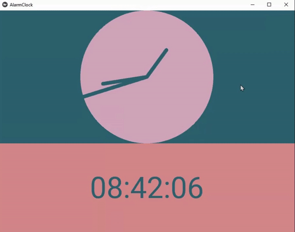
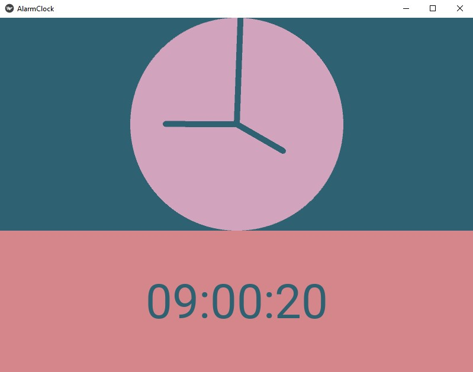
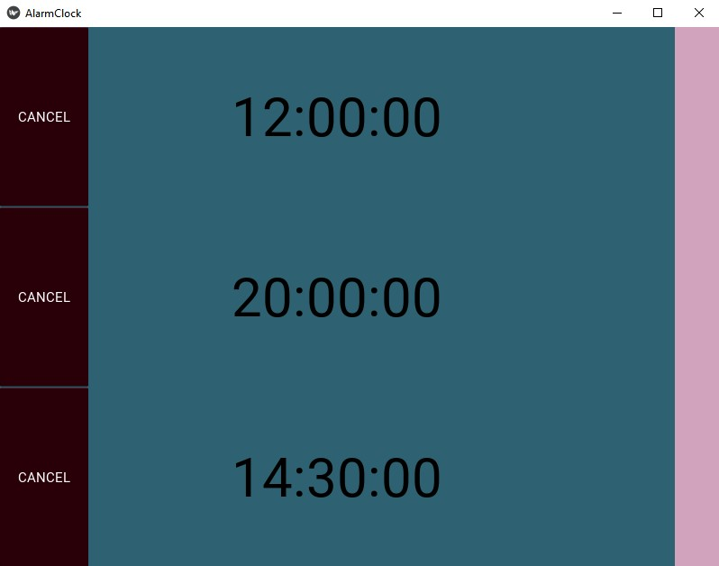
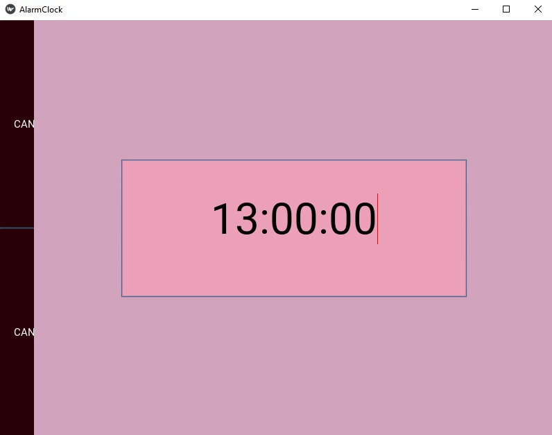

<h1 align="center">Alarm-Clock made with Python and Kivy.</h1>

<h2 align="center">See the time. Set a maximum of 8 alarms. Cancel alarms.</h2>

<h2 align="center">How to run it?</h2>

You must have Python 3 and Kivy installed

Python 3: https://www.python.org/downloads/

Kivy: https://kivy.org/doc/stable/gettingstarted/installation.html

Then, clone or download this repository, go into the folder alarm-clock and run main.py

<h2 align="center">Watch the time pass.</h2>

<h2 align="center">See all the alarms you have set. You can also cancel any of them.</h2>

  
<h2 align="center">Set a maximum of 8 alarms.</h2>

