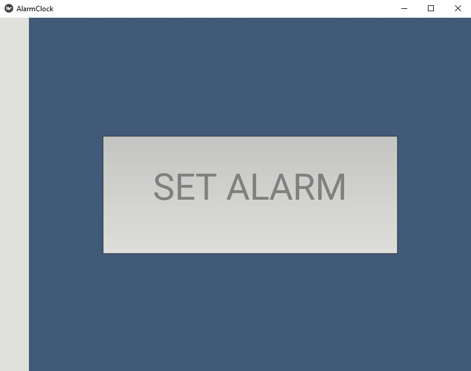

# Alarm-Clock made with Python and Kivy.
<h4>A simple alarm-clock created using Python and Kivy.</h4>
See the time. Set a maximum of 5 alarms. Cancel alarms.

# Note: project not finished yet!

# Watch the time pass.

# See all the alarms you have set. You can also cancel any of them.

# Set a maximum of 5 alarms.

