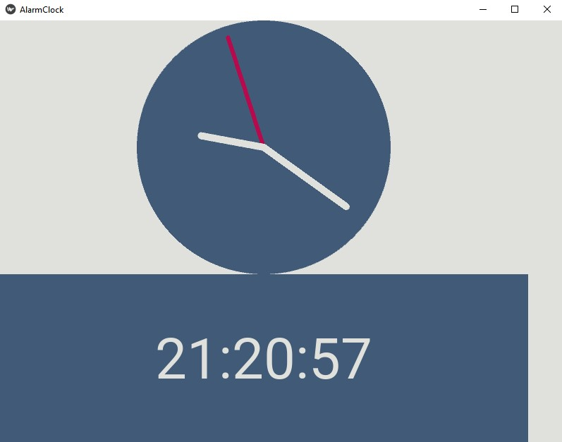
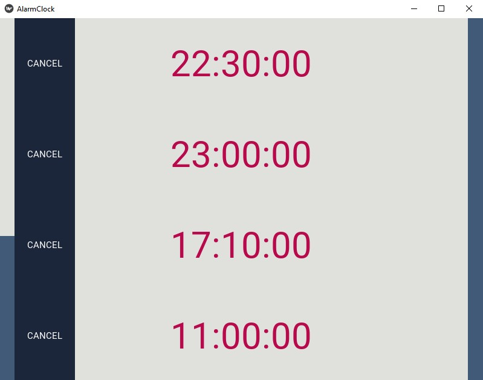

<h1 align="center">Alarm-Clock made with Python and Kivy.</h1>
<h4 align="center">A simple alarm-clock created using Python and Kivy.</h4>

See the time. Set a maximum of 8 alarms. Cancel alarms.

<h1 align="center">Watch the time pass.</h1>

<h1 align="center">See all the alarms you have set. You can also cancel any of them.</h1>

  
<h1 align="center">Set a maximum of 8 alarms.</h1>

